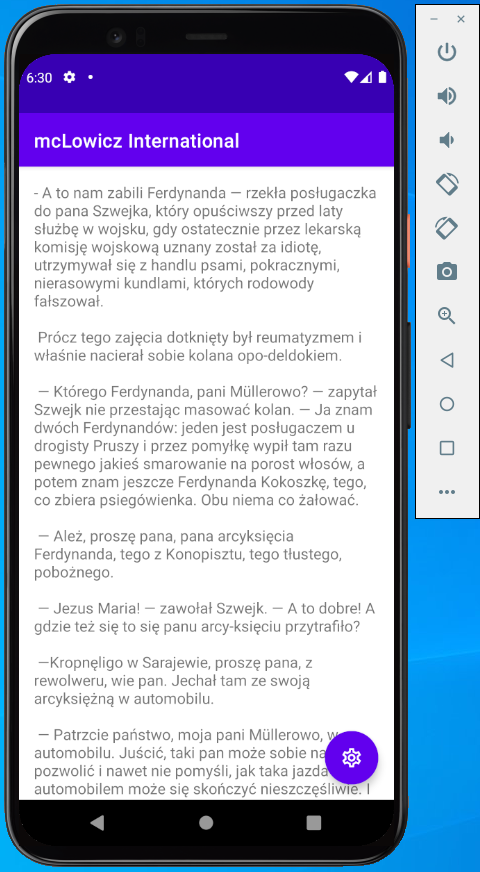
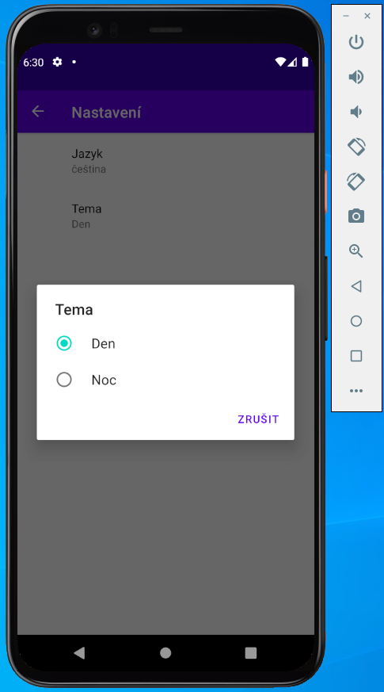
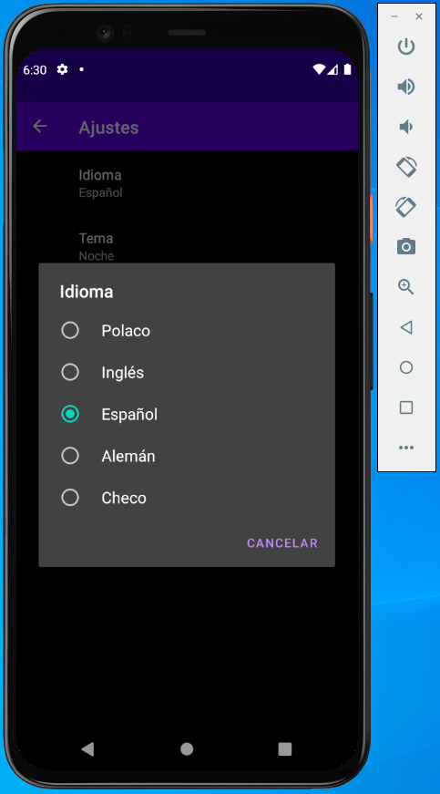
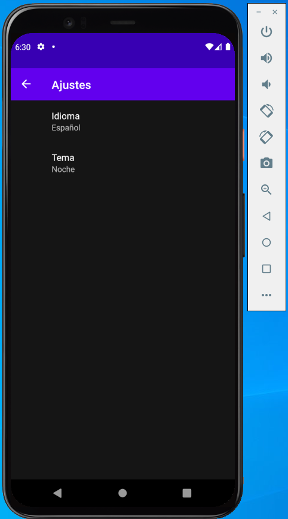
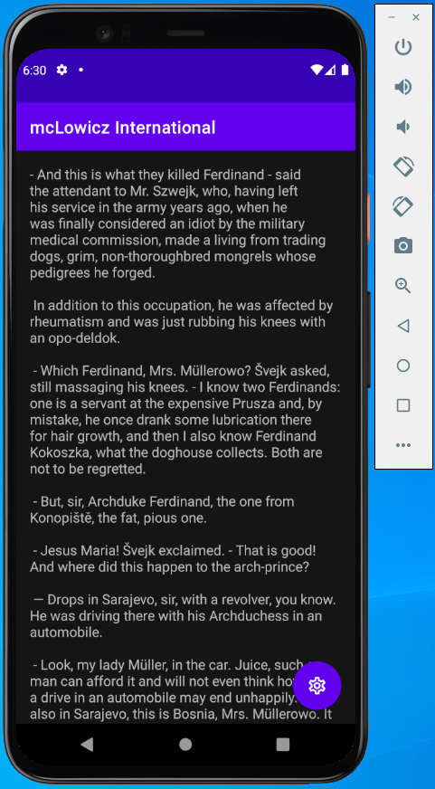

# Android Multi-Language Sample App

Intention to build this sample "**mcLowicz Interinaional**" app was to face the challenge of changing the language in the scope of whole application programmatically on the flow like in this example by preference settings. Basically, user from the perspective of app settings has possibility to change:

### 1) Language

User by tapping single menu option from one of the item listed below is able to change the language in scope of the whole application:

- English
- Czech
- Spanish
- Polish
- German

### 2) Theme mode

Apart the language user is able to choose one of the following theme:

- Day

- Night

  

**To be continued...**